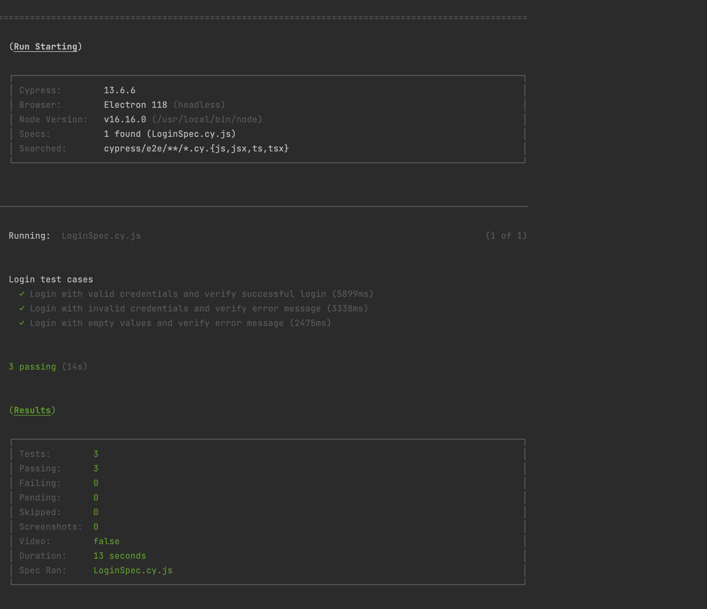
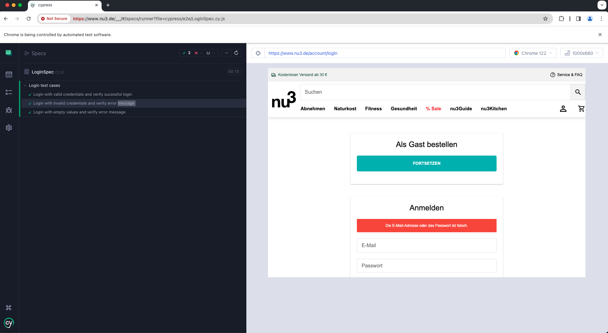

# NU3 Cypress-Assignment

## Index
- [Introduction](#introduction)
- [Required Software](#required-software)
- [Installation & Getting the Code](#getting-the-code)
- [To Run the Tests](#how-to-run-the-tests)

#Introduction
This repository holds the Cypress - Javascript Automation tests as part of the assignment of nu3 organization.

 -Automated following test cases of login module
        ✓ Login with valid credentials and verify successful login
        ✓ Login with invalid credentials and verify error message
        ✓ Login with empty values and verify error message

## Required Software
- Cypress version - 13.6.6
- JavaScript

## Installation & Getting the code
- Clone the repository using Git and save it in the local machine
- Open the cloned repository in any IDE(Preferable VS Code or IntelliJ IDE)
- Open a new Terminal and run the command "npm install"

## To Run the Tests

### How to run the tests
   Tests can be run using the following command in the terminal/commandline from the project's location folder:

   Example : "locationOfTheRepositoryDownloaded" nu3-assignment-cypress % "we need to pass the below command here"

   ```
  npm run test
  ```
### Screenshot of test case execution result


